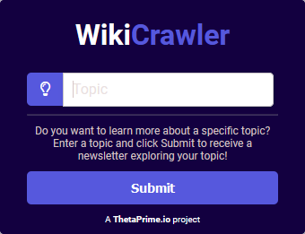
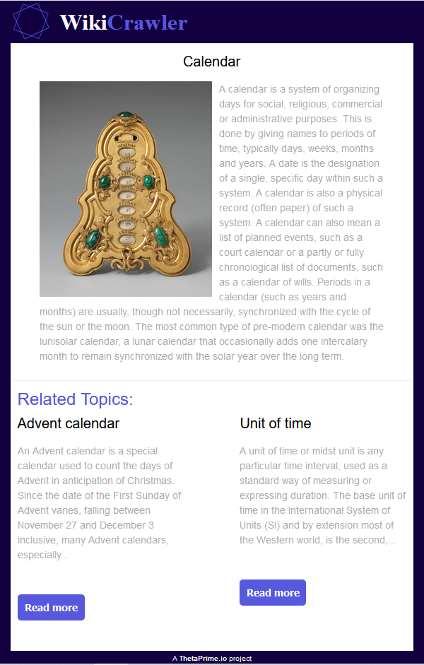

# WikiCrawler

  

### Introduction 
WikiCrawler is a web scraper that helps people explore their interests and learn more about a subject by providing the user with formatted HTML documents of wikipedia article summaries and images along with suggestions for further reading. WikiCrawler makes use of the Wikimedia REST API to obtain aggregate article view counts which it uses to sort related articles from most to least relevant. The two most relevant articles are then presented to the user as suggestions for further reading.

### Program modules
The WikiCrawler functionality has been implemented as six distinct program modules

#### RetrieveURL 
This module takes in a string specifying a topic of interest and returns the best matched Wikipedia page article for the topic.
#### RelatedLinks
This takes in a wikipedia url and returns a list of links that are related to a given wikipedia article. These links are retrieved from either the "see also" section or the first page in the related categories section of a wikipedia page. 
#### SortPopularLinks
This module takes as an argument a list of wikipedia links and returns a list of the wikipedia links along with their view count sorted from highest to lowest views.	 
#### RetrievePageInfo
This takes in a wikipedia url and returns a list of links that are related to a given wikipedia article. These links are retrieved from either the "see also" section or the first page in the related categories section of a wikipedia page. 
#### GenerateHTMLReport
Takes in a set of page summaries and outputs a corresponding HTML newsletter for the user provided 

#### LogicModule_console
This module is responsible for combining the other modules together into one program. When you run this file it will allow user interaction via the console.
#### LogicModule_web
This module is responsible for combining the other modules together into one program. This module is utilized when using the web version of this program.
#### Server.py
This file using the http python library to create a local web server in order to provide the user with a pleasant HTML interface.
#### index.html
This is the HTML file that contains user interface.

### Conclusions 
1. Relevance of topic suggestions can be improved by considering additional metrics 
2. Improvement in run time and category search space can be achieved by hosting on a cloud server 
3. Additional product features such as a automated emails containing summary documents can be added to improve user experience  

### How to run the code
To use WikiCrawler, simply run server.py, go to localhost:8080/ on your web browser and provide a topic of interest when prompted. Ensure that you have the following libraries installed: 
- beautifulsoup4
- requests
- urllib3
- wikipediaapi

### Contact information 

For any communication relating to this project, please email us at contact@thetaprime.io.

